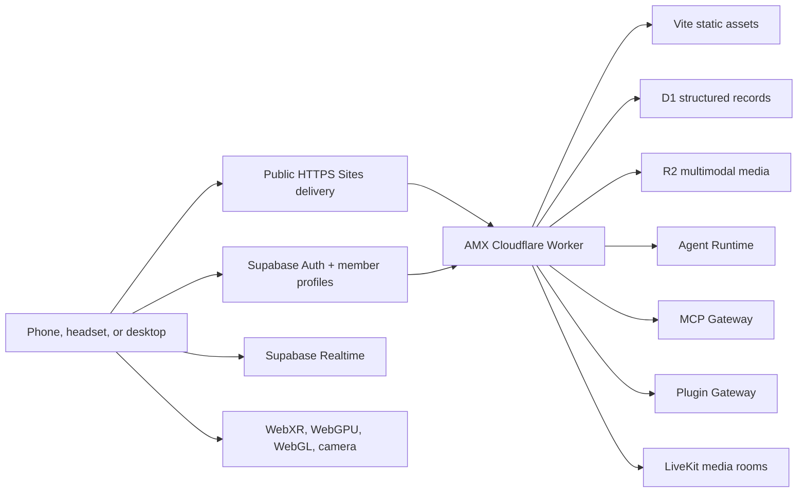

# Architecture

## System Context

The browser is responsible for interaction, rendering, camera capture, local drafts, and offline queues. Supabase Auth establishes member identity and database roles. The Worker revalidates private API sessions against Supabase before persistence, remote agent/tool execution, media storage, and operator operations.

## Client Layers

| Layer | Primary files | Notes |
| --- | --- | --- |
| Shell and routes | `src/App.tsx`, `src/components.tsx` | Responsive navigation and application routes |
| Mission operations | `src/pages/core.tsx`, `src/operations.ts` | Mission lifecycle, drafts, pods, and offline queue |
| XR rendering | `src/ARScene.tsx`, `src/ImmersiveWorld.tsx`, `src/webgpu.ts` | Three.js WebGPU/WebGL and WebXR session management |
| Spatial operations | `src/pages/nexus.tsx`, `src/geospatial.ts` | Blender GLB room, anchors, mapping, and fleet state |
| Media rooms | `src/LiveKitPod.tsx`, `src/realtime.ts` | LiveKit video/audio and Supabase presence/messaging |
| Agent operations | `src/pages/agent-workbench.tsx`, `src/agent-runtime.ts` | Multimodal intake, runtime calls, plugins, MCP, and traces |
| Proof and analytics | `src/platform.ts` | Device-local proof plus Worker synchronization |

## Server Layers

`worker.js` contains a small, dependency-free Worker runtime:

1. Security headers and nonce-based Content Security Policy.
2. Request IDs, structured JSON logs, and in-isolate rate limiting.
3. Bounded JSON/media parsing and route-specific validation.
4. Agent Runtime, MCP, and Plugin gateway clients with HTTPS enforcement, timeouts, response limits, and server-only bearer tokens.
5. D1 persistence helpers and R2 media operations.
6. LiveKit token issuance with a 15-minute participant token.
7. Liveness and configurable readiness evaluation.

## Data Ownership

| Data | Authoritative store | Local fallback |
| --- | --- | --- |
| Proof records | D1 | `localStorage` and offline queue |
| Analytics | D1 | Last 500 events in `localStorage` |
| Agent-run metadata | D1 | No durable local copy |
| Images, audio, video, code, files | R2 | Object URL plus inline payload up to 4 MB |
| Room messages and presence | Supabase Realtime or Durable Object | BroadcastChannel |
| Camera and microphone tracks | LiveKit | Device-local preview |
| UI preferences and drafts | Browser storage | Browser storage is intentional |
| Member identity and role | Supabase Auth + `member_profiles` | No local authorization fallback |

R2 stores media bytes. D1 stores only searchable metadata. Agent prompts are not written to D1 by the Worker; only operational run metadata is persisted.

## Runtime Modes

- `full`: every known integration is configured.
- `degraded`: core application is ready and one or more optional integrations are absent.
- `not-ready`: an integration named in `REQUIRED_SERVICES` is absent or invalid.

The UI must preserve these distinctions. Local fallbacks are functional but never labeled as remote, durable, LiveKit, Plugin, or MCP connections.

## AI digital twin layer

The twin runtime is split across src/digital-twin.ts, src/DigitalTwinLab.tsx, and src/DigitalTwinScene.tsx. It owns telemetry provenance, predictive risk, governed scenarios, Blender node bindings, Supabase synchronization, D1 audit events, and the conversational Agent Runtime context. See AI_DIGITAL_TWIN.md for the Blender and safety contracts.
