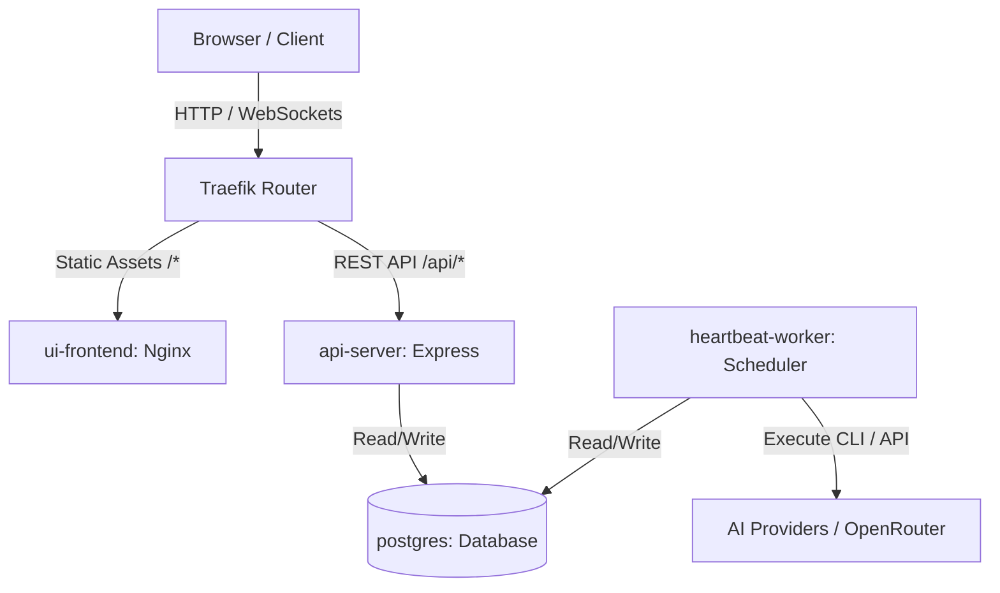

# 2026-06-09 Microservices Bundling Plan

This plan outlines the architecture, container configurations, and environment mappings to separate the monolithic Paperclip server into decoupled, production-grade microservices:
1. **`api-server`**: Dedicated Express REST API server.
2. **`ui-frontend`**: Lightweight Nginx server hosting static React assets.
3. **`heartbeat-worker`**: Standalone background scheduler running agent loops.
4. **`database`**: Dedicated PostgreSQL instance.

---

## 1. Architectural Layout

Decoupling services allows independent scaling, reduced footprint, and stronger security configurations.



### Decoupled Service Parameters:
* **API Server:** Disables UI hosting and disables local heartbeat scheduling.
  * `SERVE_UI=false`
  * `HEARTBEAT_SCHEDULER_ENABLED=false`
* **Heartbeat Worker:** Disables HTTP API interface and disables UI hosting. Runs only the background agent loop.
  * `SERVE_UI=false`
  * `PORT=0` (or binds to a internal dummy port, as it exposes no public routes)
  * `HEARTBEAT_SCHEDULER_ENABLED=true`
* **UI Frontend:** Static files served via Nginx or Caddy. Proxy rules route any request matching `/api/*` to the `api-server` microservice.

---

## 2. Docker Compose Configuration

We will introduce a new file `docker-compose.microservices.yml` implementing this architecture.

### [NEW] `docker-compose.microservices.yml`
```yaml
services:
  db:
    image: postgres:17-alpine
    restart: unless-stopped
    environment:
      POSTGRES_USER: paperclip
      POSTGRES_PASSWORD: ${POSTGRES_PASSWORD:-paperclip}
      POSTGRES_DB: paperclip
    healthcheck:
      test: ["CMD-SHELL", "pg_isready -U paperclip -d paperclip"]
      interval: 5s
      timeout: 5s
      retries: 10
    volumes:
      - pgdata-micro:/var/lib/postgresql/data

  api-server:
    build: .
    restart: unless-stopped
    environment:
      DATABASE_URL: postgres://paperclip:${POSTGRES_PASSWORD:-paperclip}@db:5432/paperclip
      PORT: "3100"
      SERVE_UI: "false"
      HEARTBEAT_SCHEDULER_ENABLED: "false"
      PAPERCLIP_DEPLOYMENT_MODE: "authenticated"
      PAPERCLIP_DEPLOYMENT_EXPOSURE: "private"
      BETTER_AUTH_SECRET: "${BETTER_AUTH_SECRET:?BETTER_AUTH_SECRET must be set}"
      PAPERCLIP_AGENT_JWT_SECRET: "${PAPERCLIP_AGENT_JWT_SECRET:-}"
    depends_on:
      db:
        condition: service_healthy
    healthcheck:
      test: ["CMD-SHELL", "curl -fsS http://127.0.0.1:3100/api/health || exit 1"]
      interval: 10s
      timeout: 5s
      retries: 5

  heartbeat-worker:
    build: .
    restart: unless-stopped
    environment:
      DATABASE_URL: postgres://paperclip:${POSTGRES_PASSWORD:-paperclip}@db:5432/paperclip
      SERVE_UI: "false"
      HEARTBEAT_SCHEDULER_ENABLED: "true"
      PAPERCLIP_DEPLOYMENT_MODE: "authenticated"
      BETTER_AUTH_SECRET: "${BETTER_AUTH_SECRET:?BETTER_AUTH_SECRET must be set}"
      PAPERCLIP_AGENT_JWT_SECRET: "${PAPERCLIP_AGENT_JWT_SECRET:-}"
      # Provide credential access for OpenRouter and OpenCode if running agent tasks
      OPENAI_API_KEY: ${OPENAI_API_KEY:-}
      ANTHROPIC_API_KEY: ${ANTHROPIC_API_KEY:-}
      OPENROUTER_API_KEY: ${OPENROUTER_API_KEY:-}
    volumes:
      - paperclip-worker-data:/paperclip
    depends_on:
      db:
        condition: service_healthy

  ui-frontend:
    image: nginx:alpine
    restart: unless-stopped
    ports:
      - "80:80"
    volumes:
      - ./ui/dist:/usr/share/nginx/html:ro
      - ./docker/nginx.conf:/etc/nginx/conf.d/default.conf:ro
    depends_on:
      api-server:
        condition: service_healthy

volumes:
  pgdata-micro:
  paperclip-worker-data:
```

### [NEW] Nginx Reverse-Proxy config: `docker/nginx.conf`
```nginx
server {
    listen 80;
    server_name localhost;

    location / {
        root /usr/share/nginx/html;
        index index.html index.htm;
        try_files $uri $uri/ /index.html;
    }

    location /api/ {
        proxy_pass http://api-server:3100/api/;
        proxy_http_version 1.1;
        proxy_set_header Upgrade $http_upgrade;
        proxy_set_header Connection 'upgrade';
        proxy_set_header Host $host;
        proxy_cache_bypass $http_upgrade;
    }
}
```

---

## 3. Verification Plan

1. **Local compilation:** Build the UI (`pnpm --filter @paperclipai/ui build`) to generate the `ui/dist` folder.
2. **Launch environment:** Run `docker compose -f docker-compose.microservices.yml up -d` to verify service orchestration.
3. **Verify API/UI boundary:** Verify that accessing `http://localhost/` loads the UI, and requests are successfully proxied to the backend REST endpoints.
