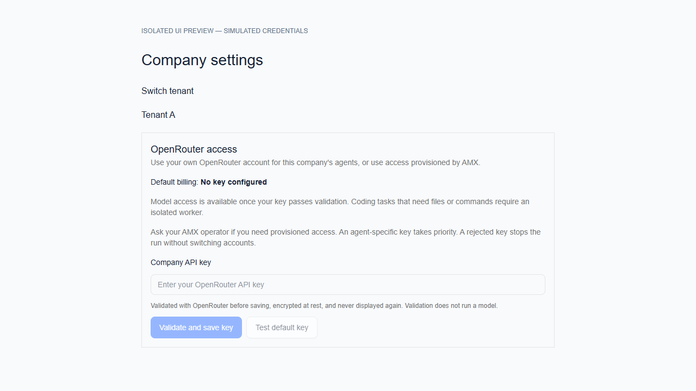
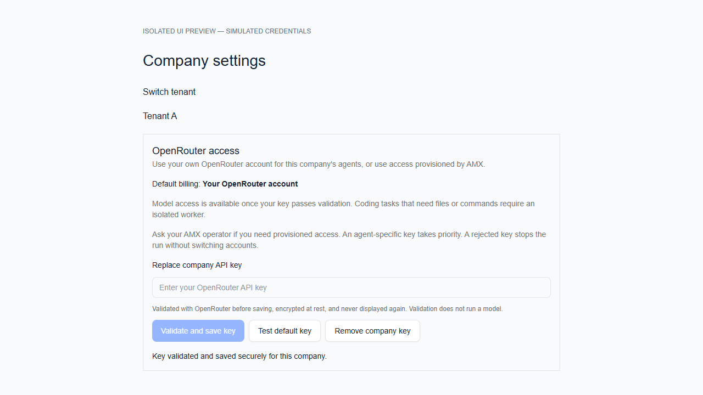

# OpenRouter tenant credentials

AMX-AIR-HUBS only. Development source and verification artifacts remain in the F-drive OPPRRC workspace.

Company owners/admins manage their own OpenRouter key under Company settings → OpenRouter access. API routes enforce board identity, company membership, and admin role. Client/viewer roles retain existing permissions; a customer managing their own tenant must be an owner/admin of that company.

Keys use the existing encrypted company secret named `OPENROUTER_API_KEY`. Saving first validates against OpenRouter `GET /api/v1/key`, without model inference. Replacement rotates the secret, keeping existing latest-version references current. Responses and audit records contain no key material. The form clears submitted values and does not store them in query/mutation caches.

Runtime order:
1. Explicit agent environment key/secret reference.
2. Current company's `OPENROUTER_API_KEY` secret, resolved with company ownership checks.
3. Operator's server `OPENROUTER_API_KEY`, only for company UUIDs explicitly listed in server `PAPERCLIP_OPENROUTER_COMPANY_IDS`.

An empty, unresolved, rejected, disabled, or expired tenant key never falls through to operator billing. Changing the company default does not replace explicit agent overrides. Remove a stale override to use the new default.

Operator provisioning: set the server key privately and set `PAPERCLIP_OPENROUTER_COMPANY_IDS` to comma-separated approved company UUIDs, then recreate the app container. Wildcards are not supported. Every Compose service exposing the server key forwards both billing and host-tool grants, with empty defaults. The corresponding environment examples document both settings. Kubernetes uses the base ConfigMap and Helm uses `values.yaml` under `env`; both default to empty grants. These are operator settings, not tenant-editable environment overrides. No shared keys or grants are shipped in Git. All existing server-key consumers need an explicit grant before deploying this change; otherwise their runs will stop with a configuration error. This change does not alter budgets or create OpenRouter subkeys automatically.

API: `GET`, `PUT { value }`, `DELETE /api/companies/:companyId/openrouter-credentials`; `POST .../validate`. PUT validates before storage and returns 422 on rejection. GET returns configuration status, not proof of provider acceptance. Validation returns `{ valid, message }`. Removing a company default may switch to operator billing only if previously provisioned; the UI explains and confirms this effect.

Host tool boundary: this adapter's existing file and command tools run with server privileges, so they are disabled unless the company UUID is explicitly in server `PAPERCLIP_OPENROUTER_TRUSTED_TOOL_COMPANY_IDS`. This is separate from billing grants and must only include operator-controlled, trusted companies. Ungranted companies have model-only access; instruction/memory file reads and unexpected model tool calls are also blocked. Do not grant this to external tenants: use isolated workers for their coding tasks. Other adapter execution isolation is outside this credential change; do not treat company-scoped secret storage as proof that arbitrary host runtimes are safe for untrusted tenants.

Validation must cover tenant isolation, role restrictions, credential precedence, invalid-key rejection, sanitized errors, and successful company-key validation/storage. Production CBU credential remains unchanged until the code is deployed and a valid key is supplied privately. Do not claim the existing 401 is fixed by a local source change.

## Local verification (2026-09-09)

- 34 focused tests passed: credentials, tenant endpoint authorization and rate limits, company secret resolution, actual adapter rejection behavior, host-tool denial, and existing redaction tests.
- OpenRouter adapter typecheck passed. Focused TypeScript checks for the new UI and API/secret/redaction modules passed with the existing Express declarations included.
- Full recursive typecheck/build attempted; both stop in the separate `amx-air-hubs` Sites workspace due to missing dependencies in the verification image. Broader package checks also find missing dependencies for the plugin scaffolding package.
- The AMX UI bundle attempt stops on missing `html2canvas` in the verification image. The full test attempt reports three embedded database startup timeouts and stalls with `initdb` in disk I/O wait. Broader app typechecks also stall in disk I/O wait. These are incomplete checks, not a passing release gate.
- Verification used an isolated, network-disabled container from the existing local AMX image (Node 24.18.0, Vitest 4.1.8) with the F-drive source snapshot overlaid. It did not use production database volumes or invoke any paid model. The native F-drive dependency install was stopped after very slow progress and low available memory.
- Logs and focused-check configurations are under the F-drive OPPRRC reports and resources directories. Production deployment, live credential replacement, real-provider validation, and isolated tenant coding workers remain pending.

## Rollout preparation (2026-09-14)

The feature is ported separately onto the current `experimental` branch. No database migration is introduced. Existing shared-key users must receive explicit billing grants or their own tenant key before rollout; host-tool grants are a separate operator decision and must not be given to external tenants.

Completion requests reject redirects and sanitize transport, malformed JSON, and provider error-envelope failures. A positive `timeoutSec` supplies one deadline for setup, all model requests and response bodies, and tool execution. Command tools receive only the remaining budget. Explicit zero means no run timeout; the default is 120 seconds. Deadline timers are cleared when the run settles. The isolated preflight explicitly sets a 120-second run budget. Model discovery has a ten-second timeout. The credential form discards unsaved secrets and feedback when switching companies.

The isolated command validates authentication without calling the Paperclip API or connecting to a database:

```sh
node cli/node_modules/tsx/dist/cli.mjs scripts/openrouter-preflight.ts --company-id <company-id> --agent-id <agent-id> --model <model> --key-file <private-file>
```

The private file contains only the provider key and stays outside Git. Alternatively, the probe reads `OPENROUTER_API_KEY` from its own environment. Add `--infer` to test the actual adapter against the configured model with a fixed short prompt. This may incur provider charges. It disables host tools, carries no agent JWT, memory, saved session, or instructions, and never writes production run/task/cost records. A live provider pass is separate from mocked regression results.

Local validation of these source changes: 51 focused server tests and one interactive tenant-switch UI regression passed using the installed Vitest 3.2.4 runner. Adapter and UI typechecks passed. The earlier preflight baseline also passed full workspace typecheck and build. The installed default Vitest runner has a cache startup error; clean candidate CI remains required. No claim is made that tests from a different source/dependency snapshot replace candidate CI.

Browser review used the real React component with simulated API responses, no production data, and no real credentials. Save clears the input and updates account status; switching tenants resets the form. The only browser console error was a missing preview favicon. These are screenshots of form states, not evidence of a live credential save:





Deployment remains gated on candidate CI, security scans, signed image, staging, recovery evidence, and human approval of the exact production release. Updating local code or submitting this PR does not repair an invalid production provider key.

## Review fixes (2026-09-14)

The initial candidate passed all required PR checks. Automated review then identified missing grant forwarding outside the VPS manifest and a mismatch with the whole-run timeout contract; these are fixed in the follow-up commit. Six deadline regressions cover unlimited requests, multiple model turns, response bodies, setup, command budgets, and timer cleanup. A deployment regression renders every provider-enabled Compose manifest with synthetic inputs in two cases: empty grants and explicit, distinct billing/tool grants. It starts no services and excludes real environment files and provider keys. Fresh candidate CI is required after this commit; earlier green checks do not certify the new head.
