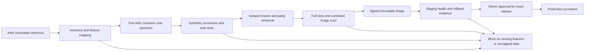

# AMX-AIR-HUBS upstream migration

Status: schema extensions, synthetic conversion and restore, and initial tenant
security adapters are implemented. Application integration and release validation
remain incomplete. This branch is not a replacement deployment.

## Implementation evidence

- Drizzle generated the AMX extension migration with 59 retained AMX tables and
  18 retained columns. The constructed target has 238 tables.
- An explicit conversion map preserves all columns in the 123 source tables.
  Synthetic conversion validates values before quarantining runnable state.
  A separate backup restore validates all source tables and the original journal.
- Secret references receive explicit company bindings. Foreign-company references,
  conflicting versions and inferred privileged projections fail the rehearsal.
- OpenRouter uses an isolated OpenCode runtime, explicit tenant credentials and
  bounded execution. Remote execution no longer inherits host provider environment
  variables or provider configuration files.
- Company creation and import preserve the AMX approval default and explicit opt-outs.
- Focused results: 18 Python guard tests, 7 shared compatibility tests, 19 remote
  adapter tests, 107 portability/OpenRouter tests, 20 database-backed company tests,
  6 company-role tests, 250 Worker contract tests and 9 release helper tests pass.
  Shared, OpenCode and focused OpenRouter typechecks pass.
- Full server typechecking exceeded the local container memory limit. Full
  workspace checks, complete feature integration, image scanning, real storage/key
  recovery and staging are not validated. No application or release was deployed.

The synthetic converter does not yet handle populated legacy instance settings.
Restored Worker, XR and AMX route/service source is preservation work; unmounted
modules and contract tests do not establish runtime feature parity.

The owner selected a reviewed upstream migration on September 13, 2026.
Preserve the AMX feature set, data and human release controls. AMX-HUBS.cc is a
separate project and is outside this migration.

## Source identity and evidence

| Role | Immutable source |
| --- | --- |
| AMX reference with authorization/runtime bridge fixes | `daaae8eb4a885b80e3ac0dcaf611b3ed09361d9d` |
| Upstream candidate, release `v2026.831.1` | `65ec059bde30d98c92165b24a30a540800dd1f6f` |
| Isolated local branch | `codex/amx-upstream-migration-20260913` |

The original development checkout and its uncommitted work remain separate.
The bridge is draft PR **Fix tenant authorization and scan release images
before merge** in `Zo-hund/Zo-hund-paperclip-surfer`. Its full application tests,
native CLI checks and authenticated runtime smoke passed. Its image scan still
blocks release. Those results do not validate this upstream candidate.

Evidence is retained outside Git at
`F:/AMX-AIR-HUBS-LOCAL/OPPRRC/05_reports/BOARD-INTERNAL/development/migration-20260913`:

- `inventory-v4.json`: authoritative static inventory for this pair.
- `journal-check-final.log`: incompatible-prefix result; native process exits `2`.
- `preflight-tests.log`: 15 offline tests pass, including compatible and
  incompatible journals, changed SQL/metadata, missing SQL, historical indexes,
  snapshot-column differences, dirty-file isolation and write-once evidence.
- `amx-table-preservation.csv`: 59 baseline-only table declarations, all retained
  in migration scope and marked pending.
- `amx-column-preservation.csv`: baseline-only columns from shared snapshots.
- Earlier inventory versions are retained as preliminary evidence. Version 4
  includes route-file matching, metadata identity, historical index handling,
  and limits snapshot reads to the latest snapshots to reduce memory use.

The repeatable tool and offline tests are in `scripts/amx-migration/`.
An identical upstream-to-upstream comparison also returned native exit `0`.

## Verified compatibility findings

- 1,095 AMX-only files; 3,847 upstream-only files; 817 changed shared paths.
- AMX has 123 literal table declarations; upstream has 179. There are 59 AMX
  table names absent from upstream and 40 shared names in changed schema files.
- 213 AMX route declarations do not match the upstream file/method/path tuple.
  Renames and mount differences still require manual mapping.
- Journals contain 83 AMX entries and 229 upstream entries. Only the first 46
  entries have identical metadata and SQL. There are 37 divergent index pairs.
- Shared snapshot differences include AMX scheduling/profile/harness fields,
  company branding/deployment/public-directory fields, member credential
  metadata, run simulation/promotion fields, and issue lifecycle stage.
- Upstream changes secret storage to support scopes, owners, provider configs
  and explicit target bindings. Existing encrypted values alone do not satisfy
  the new authorization and resolution contract.
- AMX defaults new-agent approval to true; upstream defaults it to false.
  Preserve explicit AMX values and the AMX new-company governance default.
- The AMX OpenRouter adapter falls back to a host provider key, resolves tool
  paths without checking workspace containment, and runs model-selected shell
  commands in the host process context. It cannot be copied into a tenant-safe
  runtime without redesign and rejection tests.
- Upstream requires Node 24.11 or newer. Its stock image still uses the same
  Debian family implicated in the bridge scan and has a different tool set.
  Upstream adoption alone does not fix the operating-system findings or prove
  that all AMX adapter runtimes are present.
- The checked-out upstream package manifests still contain `0.3.1`; a release
  tag is not the package identity embedded in an image. Review the legitimate
  release versioning process and the compiled code before treating any advisory
  as fixed. Do not rename packages to hide scanner findings.

Static snapshots and names are evidence for investigation, not a database
conversion specification. No application data was read by this inventory.

## Feature-preservation work packages

Every row is required. No feature is implicitly retired by absence upstream.

| AMX area | Source anchors | Required implementation and acceptance |
| --- | --- | --- |
| Tenant keys and owner provisioning | `packages/adapters/openrouter/`, `server/src/routes/agents.ts`, secret services and adapter config UI | Map company/user secret ownership and explicit bindings; preserve tenant key precedence and explicit owner provisioning; reject cross-company reads, revoked keys, unauthorized spend and host-key inheritance. |
| Agent lifecycle and work | `server/src/routes/agents.ts`, agent schemas and heartbeat services | Preserve IDs, reporting links, schedules, pause/budget gates, approvals and audit history. Rehearsal agents remain disabled until an explicit test enables one with a stub provider. |
| AMX cloud application | `amx-air-hubs/` (375 unique paths) | Preserve the separate Worker/API/UI contracts and bindings. Review each deployment target independently; no blanket source copy or Cloudflare publication. |
| OpenRouter and other runtimes | `packages/adapters/`, `runpod-worker/`, `voice-agent/` | Use an isolated execution boundary and company-scoped credentials. Keep cancellation, timeouts, logs, token/cost accounting and required native tools. Test without paid provider calls. |
| XR and factory views | `amx-xr-pathfinder-unity/`, AMX UI pages/components | Preserve simulator/live distinctions, factory navigation, XR scenes and mission workflows; no visual preview may imply live telemetry or deployment authority. |
| Credit economy and chain | `packages/db/src/schema/amx_chain.ts`, `amx_ledger.ts`, AMX routes/services | Preserve ledger amounts, references, identifiers and append-only audit history; reconciliation must balance per company before acceptance. |
| Nodes, dispatch and OPPRRC | `amx_nodes.ts`, `opprrc_deliveries.ts`, corresponding routes | Preserve leases, delivery/backup records, evidence and ownership; no copied dispatch may execute during rehearsal. |
| Public directory, profiles and toolbelts | `toolbelts.ts`, directory/profile routes, agent/company schemas | Preserve explicit opt-in visibility, harness links and skill tags. Private records stay private; missing upstream columns cannot silently discard them. |
| LMS and marketplace | `lms_*.ts`, LMS routes/UI | Preserve enrollments, progress, bookings, listings and company scoping. No payment or publication side effects in rehearsal. |
| Meetings and communications | `meetings.ts`, meeting/livekit/calendar routes, webhooks, push | Preserve participants, consent, transcripts and outcomes. Quarantine outbound delivery, guest tokens, webhook retries and scheduled work. |
| Agent memory, experiments and KPIs | agent memory/chat/KPI schemas, routes and services | Preserve attribution/history and prevent cross-company session or memory reuse. |
| Governance, memberships and billing | `governance_boards.ts`, `company_memberships.ts`, Stripe schemas | Preserve explicit permissions, credential metadata, approval defaults and idempotency records. Never infer broader rights from a missing mapping. |
| Governed deployment | AMX `deploy/release`, GitHub workflow and tests | Port exact-image signature/scan/staging/restore controls; retain owner review and production approval. Upstream workflows are not substitutes for the AMX release policy. |

## Data conversion design

Use a fresh isolated target, not an in-place upstream migrator on an AMX
database. Do not renumber, stamp or delete the AMX journal to impersonate an
upstream history. Do not use template/company export as a complete data backup;
its deliberate omissions include secret values and operational history.

1. Generate and validate the target schema from upstream plus reviewed AMX
   extensions. Use the repository's Drizzle generator; do not hand-edit schema
   snapshots. Keep the upstream journal intact and append generated changes.
2. Build an explicit per-table/per-column transformation map. Each baseline
   table, column and referenced object has a destination or a reviewed durable
   preservation path. Unknown fields stop conversion; no silent drop or
   generic positional `SELECT *` import.
3. Rehearse first with synthetic companies, users, agents, secret references,
   ledger entries, runs and uploads. All credentials are test-only. No original
   application database is necessary for this first pass.
4. For a later authorized data rehearsal, take a consistent database backup and
   matching storage/key backup with checksums and a schema fingerprint. Restore
   the source into a separate quarantine. The converter reads only that clone.
5. Validate input schema, IDs, foreign keys, company ownership, secret metadata
   and conversion version before target mutation. Write in bounded transactions
   with resumable checkpoints and content checksums. A partial run is not ready.
6. Preserve row identities where possible; record explicit mapping where a new
   identity is required. Reconcile counts and values per company, relationships,
   issue/run/audit history, ledger totals, uploads and secret-version ownership.
7. Preserve secret IDs/versions and explicit authorization. Perform decryption
   or re-encryption only within the isolated process with the matching key;
   never emit values into reports. Test tenant and responsible-user rejection.
8. Disable imported timers, routines, queued runs, webhooks, runtime desired
   states, notifications and payments before app startup. Re-enable only named
   synthetic test operations. Empty secrets must fail; they must not select
   host credentials.
9. Exercise app flows and rollback. Restore the old release, original database,
   storage and matching secret key together in the rehearsal environment.
   Document the write-freeze and post-cutover recovery policy before cutover.

Do not assume a journal-prefix failure can be fixed by executing all SQL.
Historical timestamp/index anomalies are recorded, not automatically repaired.

## Local runtime containment

Create the candidate's source, instance, dependencies, cache, logs and reports
under F-drive OPPRRC directories. Use an explicit worktree instance/home and
`--no-seed`; the upstream CLI otherwise seeds from an existing instance.
Use a checked free loopback port distinct from the existing development app.
Keep a separate database, storage root and master key. Do not inherit a default
instance, shared Codex/Claude home, provider credentials or production config.

Set `PAPERCLIP_TELEMETRY_DISABLED=1` for the candidate rehearsal; the verified
upstream configuration honors that opt-out. This is first-party telemetry,
separate from optional OTLP export and local run-log storage. Keep external
providers and communications unconfigured during synthetic tests.

Candidate dependencies are installed in isolated F-backed Docker storage. The
candidate application has not been booted. Full application checks are pending;
focused tests and synthetic conversion do not substitute for them.

## Release acceptance

Production remains blocked until all of the following have evidence tied to
the same commit/image and target:

- AMX contract matrix and table/column mapping complete.
- Typecheck, full tests, build, relevant browser flows and token gates pass.
- Security regressions prove tenant/auth/key/host-isolation boundaries.
- All required adapter tools start and operate in the intended isolation.
- Combined image scan passes the existing HIGH/CRITICAL policy; no version
  camouflage or ignored scanner failure.
- Image signature verified; staging deploy and runtime identity match digest.
- Migration, storage/secret restore and rollback rehearsal pass.
- Sole owner reviews/merges and separately approves production for that release.

The implemented preflight is an offline preparation tool. Deployment does not
yet invoke it. No new release gate or production readiness is claimed here.
